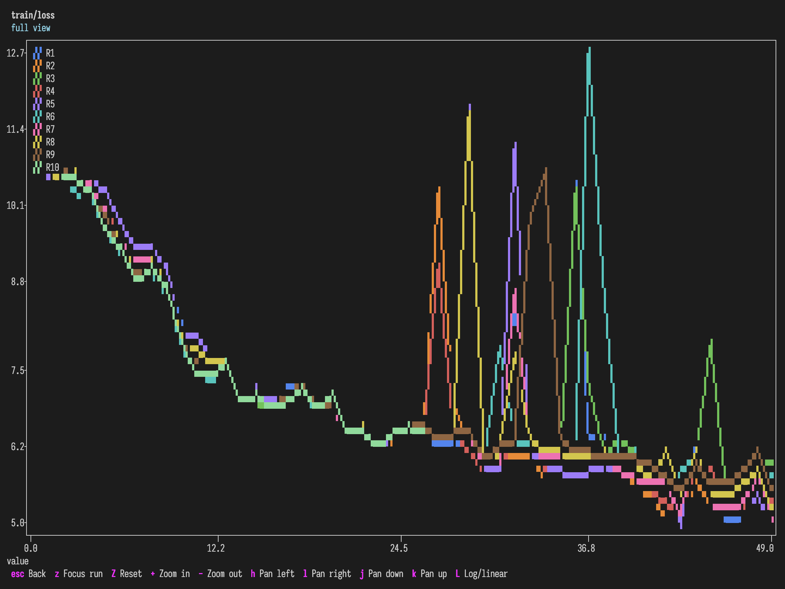
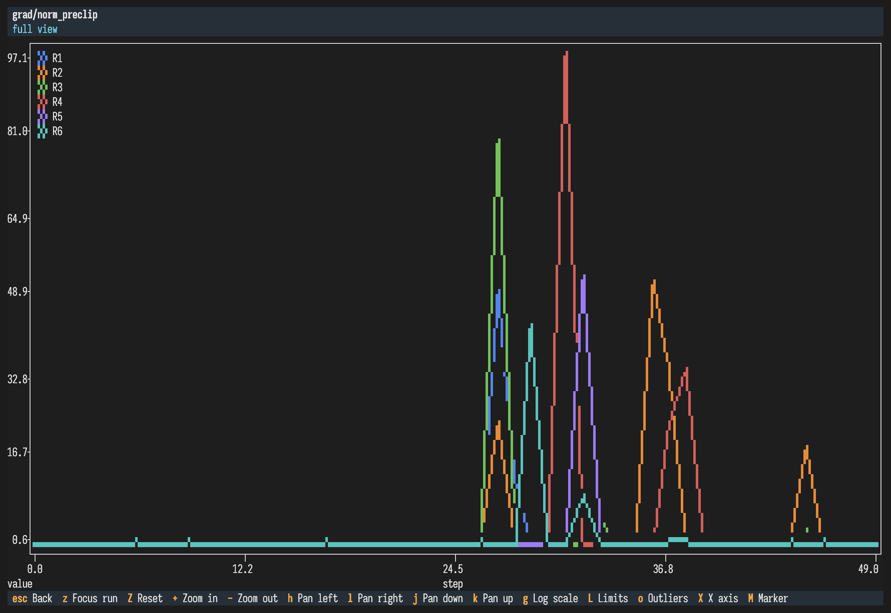
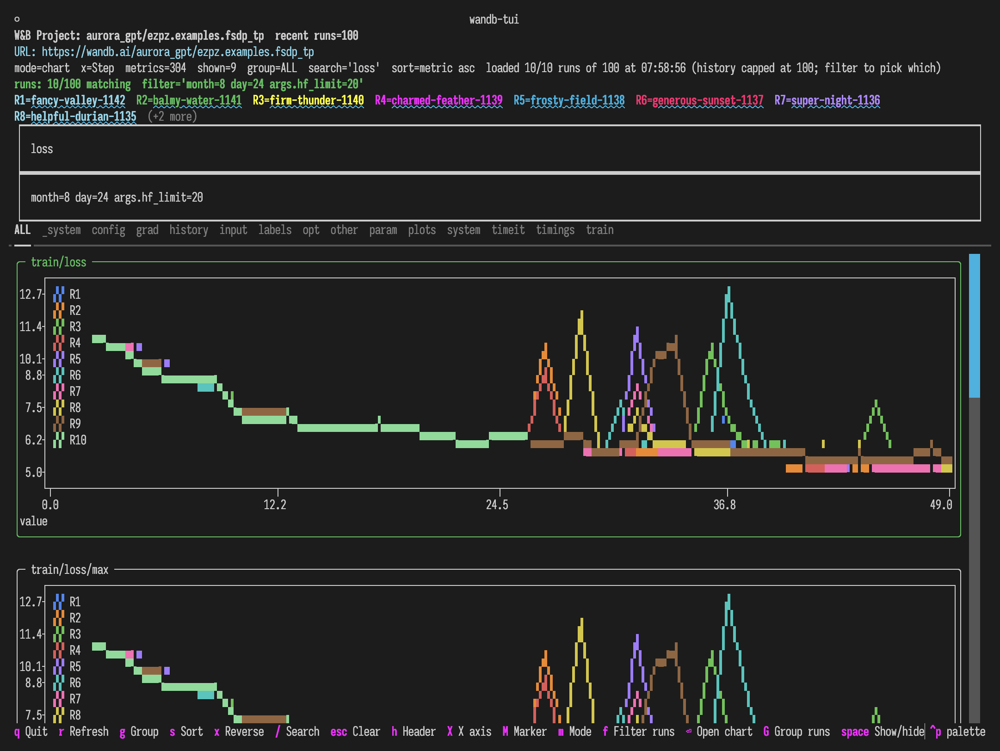
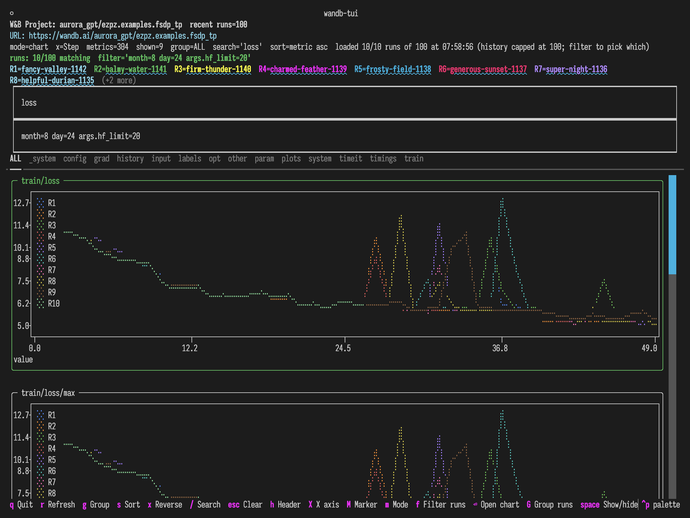
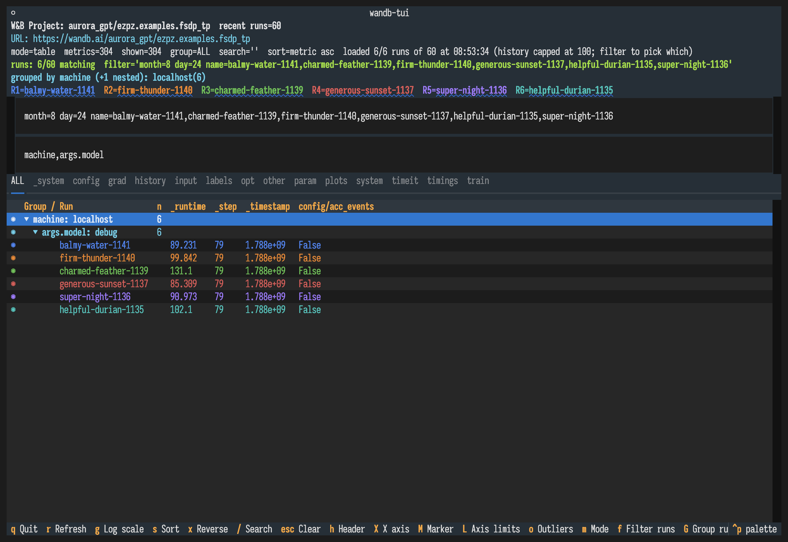
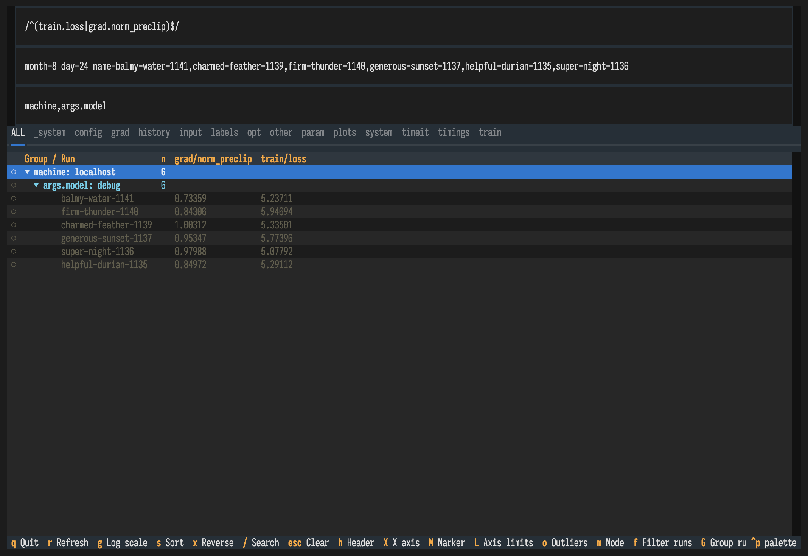
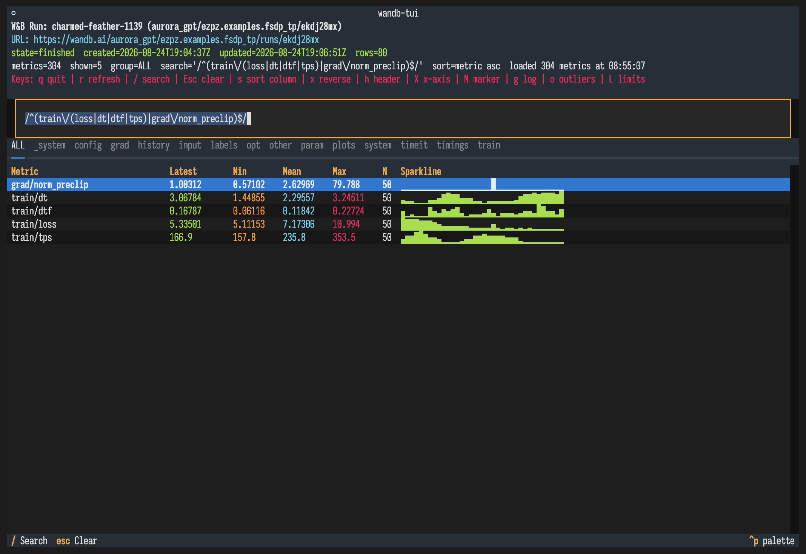
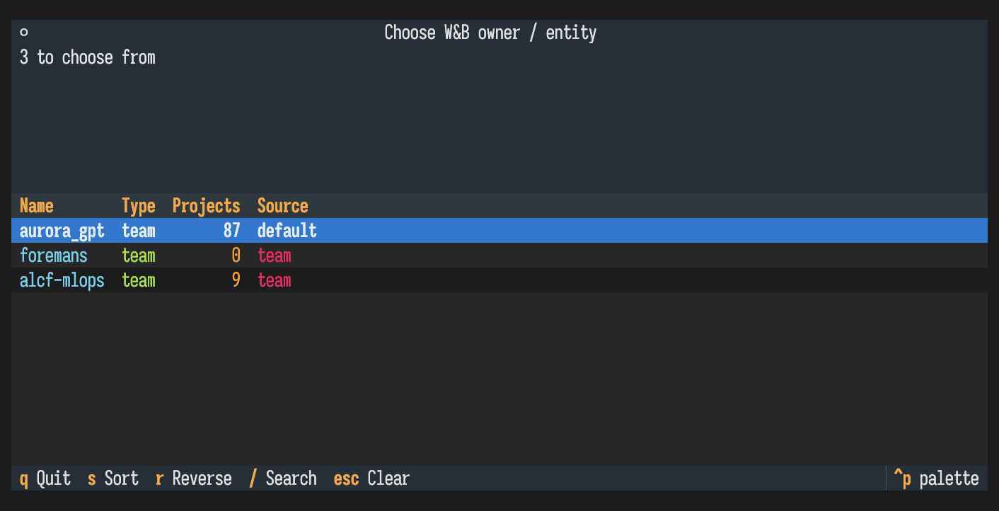

# wandb-tui

A lightweight terminal dashboard for comparing Weights & Biases runs directly from W&B project or run URLs.

It was built for remote/cloud W&B runs when you want a LEET-like terminal view without needing the original local `wandb/` run directories.

<picture>
  <source media="(prefers-color-scheme: dark)" srcset="assets/loss-dark.png">
  <source media="(prefers-color-scheme: light)" srcset="assets/loss-light.png">
  
</picture>

Ten runs from a 100-run project, filtered by config to one day's work:
`train/loss` descending together from 11 to ~6, then fanning out into
divergent spikes.

On a light terminal the TUI uses a matching white theme, so it sits on the
page rather than painting a grey slab over it.

## Screenshots

<kbd>Enter</kbd> opens the chart under the cursor full-screen, with zoom, pan,
per-run focus, axis limits and a log/linear toggle — here `grad/norm_preclip`
across six runs:

<picture>
  <source media="(prefers-color-scheme: dark)" srcset="assets/zoom-dark.png">
  <source media="(prefers-color-scheme: light)" srcset="assets/zoom-light.png">
  
</picture>

Chart mode tiles every matching metric and scrolls, rather than capping how
many you can see:

<picture>
  <source media="(prefers-color-scheme: dark)" srcset="assets/loss-charts-dark.png">
  <source media="(prefers-color-scheme: light)" srcset="assets/loss-charts-light.png">
  
</picture>

<kbd>M</kbd> cycles the marker. The default `hd` above packs 2×2 blocks per
cell; `braille` below packs 2×4 dots, trading weight for vertical resolution:

<picture>
  <source media="(prefers-color-scheme: dark)" srcset="assets/loss-braille-dark.png">
  <source media="(prefers-color-scheme: light)" srcset="assets/loss-braille-light.png">
  
</picture>

Group runs into a collapsible tree by any config keys, with per-run metrics
alongside and a visibility gutter for the charts:

<picture>
  <source media="(prefers-color-scheme: dark)" srcset="assets/tree-dark.png">
  <source media="(prefers-color-scheme: light)" srcset="assets/tree-light.png">
  
</picture>

Compare every metric across runs in the table, narrowed by a config filter
and a metric search:

<picture>
  <source media="(prefers-color-scheme: dark)" srcset="assets/filter-dark.png">
  <source media="(prefers-color-scheme: light)" srcset="assets/filter-light.png">
  
</picture>

A single run gets min/mean/max and inline sparklines:

<picture>
  <source media="(prefers-color-scheme: dark)" srcset="assets/singlerun-dark.png">
  <source media="(prefers-color-scheme: light)" srcset="assets/singlerun-light.png">
  
</picture>

Launch with no arguments to pick an entity and project interactively:

<picture>
  <source media="(prefers-color-scheme: light)" srcset="assets/picker-light.png">
  <source media="(prefers-color-scheme: dark)" srcset="assets/picker-dark.png">
  
</picture>

The screenshots above alternate with your GitHub theme; the TUI itself
follows your terminal's background the same way.

## Features

- Single-run metric dashboard
- Multi-run project comparison from a W&B project URL
- W&B-style per-run colored columns
- `plotext` line charts for multi-run metric overlays
- Metric search, group filtering, sorting, and refresh
- JSON export for downstream analysis
- Works against public runs without `wandb` installed; uses `WANDB_API_KEY` automatically for private runs

## Install

No install needed — run it straight from PyPI:

```bash
uvx wandb-tui --help
```

To pin a version, or to run the development version:

```bash
uvx wandb-tui@latest --help
uvx --from git+https://github.com/saforem2/wandb-tui wandb-tui --help
```

<details>
<summary>Working on wandb-tui itself</summary>

```bash
uv sync
uv run wandb-tui --help
uv run python -m wandb_tui --help   # or as a module
uv run pytest                       # tests
```

</details>

## Usage

### Interactive startup picker

If you launch without a W&B URL or `ENTITY/PROJECT`, `wandb-tui` opens a startup picker:

```bash
uvx wandb-tui
```

The picker lets you choose a W&B owner/entity, then a project, then opens the multi-run project dashboard. For private entities, set `WANDB_API_KEY` first.

### Compare recent runs in a project

```bash
uvx wandb-tui \
  'https://wandb.ai/aurora_gpt/ezpz.examples.fsdp_tp?nw=nwuserforemans' \
  --runs 8
```

Press `m` to toggle from table mode to plot mode.

### View a single run

```bash
uvx wandb-tui \
  https://wandb.ai/aurora_gpt/ezpz.examples.fsdp_tp/runs/vrxuo55p
```

### Non-interactive table snapshot

```bash
uvx wandb-tui \
  'https://wandb.ai/aurora_gpt/ezpz.examples.fsdp_tp?nw=nwuserforemans' \
  --runs 8 \
  --once \
  --search train/loss \
  --metric-group train
```

### Export JSON

```bash
uvx wandb-tui \
  'https://wandb.ai/aurora_gpt/ezpz.examples.fsdp_tp?nw=nwuserforemans' \
  --runs 8 \
  --json /tmp/wandb_project_metrics.json
```

## Controls

| Key | Action |
| --- | --- |
| `q` | Quit |
| `↑` / `↓` | Move row cursor |
| `PgUp` / `PgDn` | Page scroll |
| `Home` / `End` | Jump to first/last row |
| `Tab` | Move focus between search box and results |
| `/` | Open the search box (filters metric names) |
| `f` | Open the run filter box (project view) |
| `Esc` | Clear and close the focused box, or both when the results have focus |
| *(tabs)* | Click a metric-group tab to filter by group |
| `m` | Toggle table/chart mode in project view |
| `enter` | Open the focused chart full-screen |
| `s` | Cycle sort column |
| `x` | Reverse sort direction (group order, when grouped) |
| `h` | Hide/show the header (title, URL, filters, legend) |
| `G` | Group runs into a tree by config keys (project view) |
| `Enter` | Collapse/expand the selected group row |
| `Space` | Show/hide the selected run (or group) in charts |
| `X` | Cycle the chart x-axis |
| `M` | Cycle the chart marker (hd / braille / fhd / dot / sd) |
| `g` | Cycle chart scale: linear / y-log / x-log / log-log |
| `o` | Hide outliers (keeps the 1st–99th percentile band) |
| `L` | Set axis limits, e.g. `x=0:5000 y=2.5:13` |
| `r` | Refresh from W&B |

Single-letter keys act on the results pane. While a text box has focus they
are typed as text instead — press `Tab` or `Esc` to return focus to the results.

The search and filter boxes stay hidden until you summon them, so the results
get the full height. They close again when they lose focus — unless they still
hold a query, since a filter you can't see is worse than a spent row. Run names
in the legend are clickable links to the run on wandb.ai in terminals that
support hyperlinks (kitty, iTerm2, WezTerm, modern VTE).

The startup entity/project picker supports the same `/` search and `Esc` clear,
matching across every visible column.

## Charts

`m` switches the project view to charts: one tile per metric, sized to the
terminal and re-fit on resize. When metrics fall into more than one top-level
group (`train`, `eval`, `_system`, …) each group gets its own tab.

Three controls apply to every chart, in the grid and full-screen alike:

| Key | Action |
| --- | --- |
| `g` | Cycle linear → y-log → x-log → log-log |
| `o` | Hide outliers — keeps the 1st–99th percentile of each series |
| `L` | Axis limits: `x=0:5000 y=2.5:13`; either end may be blank for auto |

`o` is for the case where one spike flattens everything else. On a real
`grad_norm` it takes the y-axis from 77.2 down to 26.1 while dropping ~2% of
points, so the 0.1–3.0 range you actually care about fills the plot.

Focus a tile (`tab`, or click) and press `enter` to open it full-screen:

| Key | Action |
| --- | --- |
| `z` | Cycle focus through runs — fit the view to one run, dim the others |
| `Z` / `0` | Reset the view |
| `+` / `-` | Zoom x in / out |
| `h` / `l` | Pan left / right |
| `j` / `k` | Pan up / down |
| `esc` | Back to the chart grid |

Pan and zoom are local to the full-screen view, so they never disturb the
grid behind it; `Z` drops back to whatever window `L` set. `z` skips runs you
have hidden with <kbd>Space</kbd>.

## Run loading and caching

Project view loads metadata for the 100 most recent runs in a single query,
then fetches full history only for the runs that survive your filter — in
parallel, cached on disk under `~/.cache/wandb-tui` and keyed on each run's
W&B `updatedAt`, so finished runs are read from disk on every later launch.
Use `--runs` to change how many runs' metadata is loaded.

Measured on a 100-run project: a cold history pull is ~1.1s for 24 runs, 3.6s
for 50 and 10.1s for 100, but every warm load is 0.01–0.08s regardless of size.

## Chart x-axis

Charts default to **Step**. Press `X` to cycle the x-axis:

| Axis | Source |
|------|--------|
| Step | `_step` |
| Relative Time (Process) | `_runtime` |
| Relative Time (Wall) | `_timestamp`, zeroed at the run's first point |
| Wall Time | `_timestamp` |
| n_tokens_seen | `train/tokens_seen` (and common aliases) |

The screenshots above use `n_tokens_seen`.

This matters for runs that log at uneven intervals: on the sample-index axis a
47-second stall looks identical to a 1-second one. If a run does not log the
selected axis, that run falls back to its sample index rather than dropping
out of the comparison, and the status line says so.

## Grouping runs

Press `G` and type one or more config keys, comma-separated, to nest runs into
a collapsible tree — the same idea as the W&B workspace's "Group runs by..."
panel. Order is nesting order, and <kbd>Tab</kbd> completes key names.

```
G> world_size,model_spec.flavor

   Group / Run                n  loss_metrics/global_avg_loss  mfu(%)  tflops
 ◉ ▼ world_size: 12           2
 ◉   ▼ model_spec.flavor: 2b  2
 ◉       amber-snowflake-3897      3.20337                     29.135  86.876
 ◉       usual-fire-3895           2.96266                     34.939  104.2
 ◉ ▼ world_size: 48           9
 ◉   ▼ model_spec.flavor: 2b  9
 ◉       zany-hill-3733            2.70796                     29.019  86.532
 ◉       sage-shadow-3666          2.83919                     28.620  85.341
```

<kbd>Space</kbd> toggles a run's visibility in the charts, via the marker in
the left gutter (`◉` shown, `○` hidden, `◐` partly hidden). On a group row it
toggles everything beneath — collapse to a group and hide 95 runs with one
keypress. Hidden runs leave the plots but stay in the table, so their numbers
are still readable.

Each group row shows how many runs sit beneath it. <kbd>Enter</kbd> on a group
row collapses or expands it; <kbd>Esc</kbd> puts the input away but keeps the
grouping, so you can drive the tree straight after typing. Clearing the box
returns to the flat metric table.

Grouping transposes the grid: rows become the run tree, so the columns become
the first few metrics matching your current search. Narrow them with `/`.
Runs missing a key group under `(unset)`. Any config key is accepted — the
completion hint just lists the ones that actually split your runs first.

Grouping is independent of `g`, which filters which *metrics* are shown, and
composes with `f` and `/` — see
[Combining filters, groups, and search](#combining-filters-groups-and-search).

The same keys work from the command line, where `--group-by` presets the tree,
prints it in `--once`, and nests a `groups` array in `--json`:

```bash
uvx wandb-tui ENTITY/PROJECT --group-by 'world_size,model_spec.flavor'
uvx wandb-tui ENTITY/PROJECT --once --group-by world_size
uvx wandb-tui ENTITY/PROJECT --json out.json --group-by world_size
```

> **Note**
> `--group` filters *metric* groups, not runs, and is deprecated in favour of
> the clearer `--metric-group`. It still works and warns on stderr.

## Filtering runs by config

In project view, press `f` and type an expression to keep only the runs whose
config matches — the same idea as filtering a W&B workspace in the browser.
Space-separated terms are AND-ed:

```
lr>=0.001 model~llama state=finished
```

| Operator | Meaning |
| --- | --- |
| `=` / `!=` | Equal / not equal (numeric when both sides are numbers, else case-insensitive string) |
| `>` `<` `>=` `<=` | Numeric comparison |
| `~` / `!~` | Contains / does not contain (case-insensitive substring) |

A comma-separated value means "any of" — set membership rather than a range:

```
world_size=3072,6144        # exactly these two, not 4096 in between
model=llama-3,mistral       # either model
world_size!=3072,6144       # everything except those two
```

Bare keys read the run's config. Use `config.<key>` to be explicit, and
`run.<attr>` for run attributes (`run.state`, `run.name`) when a config key
would otherwise shadow them. Quote values containing spaces: `name~"my run"`.

**Completion.** The filter box suggests as you type and `tab` accepts. Typing a
prefix lists the config keys under it (`precision/` → every `precision/*` key);
once you type an operator it lists the values that key actually takes
(`dim=` → `128  256  2048`). Earlier terms of a compound filter are preserved,
so `tp=4 dim=` completes only the last term. With several matches `tab` extends
to the longest common prefix, like shell completion.

The same expression works non-interactively:

```bash
uvx wandb-tui ENTITY/PROJECT --runs 20 --filter 'lr>=0.001 model~llama' --once
```

Filtering stacks with grouping and metric search — see
[Combining filters, groups, and search](#combining-filters-groups-and-search).

## Searching metric names

Press `/` and type. Plain text is a **case-insensitive substring** match:

```
loss          matches train/loss, eval/loss, loss_metrics/global_avg_loss
mfu           matches mfu(%)
```

Wrap the query in slashes for a **regex**:

```
/^train/           anchored: train/loss, but not pretrain/loss
/loss|acc/         alternation
/^(train|eval)\//  either namespace
/(?i)LOSS/         inline flags work (search is already case-insensitive)
```

Regex is opt-in for a reason: metric names are full of regex metacharacters.
Searching `mfu(%)` as a pattern would match nothing, because the parentheses
become a capture group.

> **Note**
> A malformed pattern shows `bad regex: ...` in the meta panel and keeps the
> previous results, so a half-typed `/[a-/` never blanks the table. Note the
> asymmetry: that only applies **inside** slashes. Plain text is never a
> pattern, so `loss(` is a literal substring that simply matches nothing —
> no error, just an empty table. If a search unexpectedly comes up empty,
> check whether you meant to wrap it in slashes.

Because a metric name's separator is `/`, the closing slash is the **last**
one: `/^train/` searches for `^train`. To match a literal slash inside the
pattern, escape it — `/^train\/loss$/`.

## Combining filters, groups, and search

The three act on different axes and compose freely — none of them is a mode
you have to leave to use another:

| Key | Acts on | Answers |
| --- | --- | --- |
| `f` | which **runs** (by config) | *which experiments do I care about?* |
| `G` | how runs are **nested** (by config) | *how should they be organised?* |
| `/` | which **metrics** are columns | *what do I want to see about them?* |

A worked example — the 8-GPU runs, nested by model flavour, showing only
training metrics:

```
f> world_size=8
G> model.flavor
/> /^train/
```

```
runs=3/6  metrics_shown=2  search='/^train/'  filter='world_size=8'

Group / Run              n    train/loss    train/mfu
------------------------------------------------------
model.flavor: 2b         3
      run-0                      19.000       30.000
      run-2                      19.000       30.000
      run-4                      19.000       30.000
```

Order does not matter, and clearing one leaves the others alone — widening the
filter does not disturb your grouping.

<kbd>Esc</kbd> is not uniform across the three, though, and the difference is
deliberate. In the search and filter boxes it **clears** the term. In the group
box it only **puts the box away and keeps the grouping**, so you can start
driving the tree with <kbd>Enter</kbd> and <kbd>Space</kbd> the moment you
finish typing. To actually ungroup, empty the box instead.

Two things worth knowing:

- **Filtering happens before grouping.** Runs excluded by `f` never reach the
  tree, so group counts reflect what survived the filter (`n` above is 3, not
  6). This is usually what you want: group counts describe what you are
  actually looking at.
- **Grouping transposes the grid.** Rows become the run tree, so columns
  become the first few metrics matching your search — which makes `/` the tool
  for keeping a grouped view readable, not just a convenience.

All three work together non-interactively, including with `--json`:

```bash
uvx wandb-tui ENTITY/PROJECT --once \
  --filter 'world_size=8' \
  --group-by model.flavor \
  --search '/^train/'
```

Quote the regex in your shell — `/^train/` is fine unquoted in `bash`, but
patterns containing `|`, `(`, or `*` are not.

## W&B LEET comparison

W&B's official LEET TUI is excellent for local `wandb/` directories and `.wandb` files, and newer versions support remote single-run URLs. This tool focuses on remote multi-run project comparisons over W&B's GraphQL API.

## Notes

- Public W&B projects/runs can be queried without authentication.
- For private projects, set `WANDB_API_KEY` in your environment.
- `plotext` is included as a dependency for chart mode.
