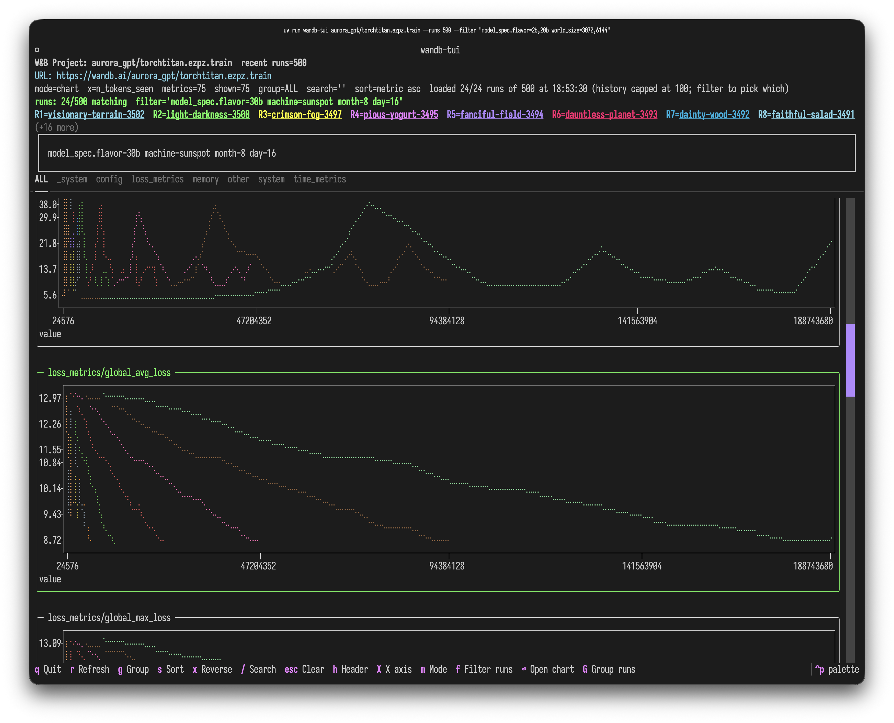
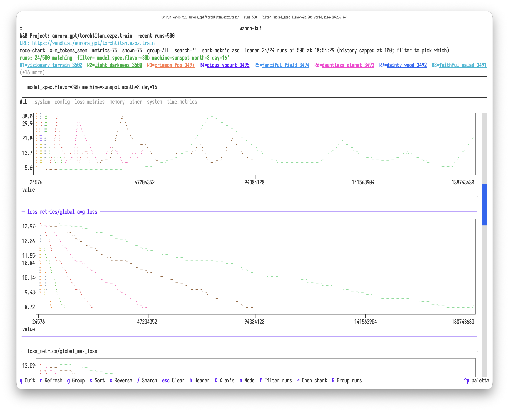
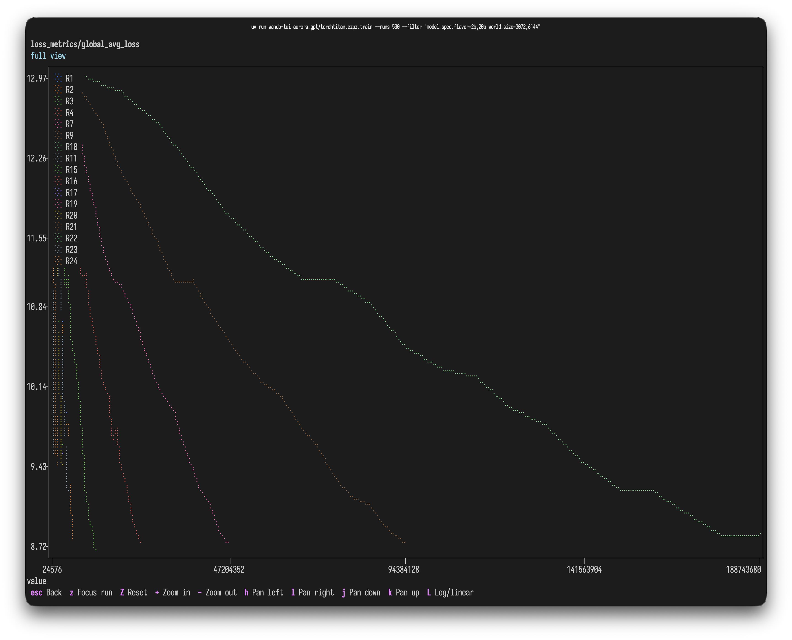
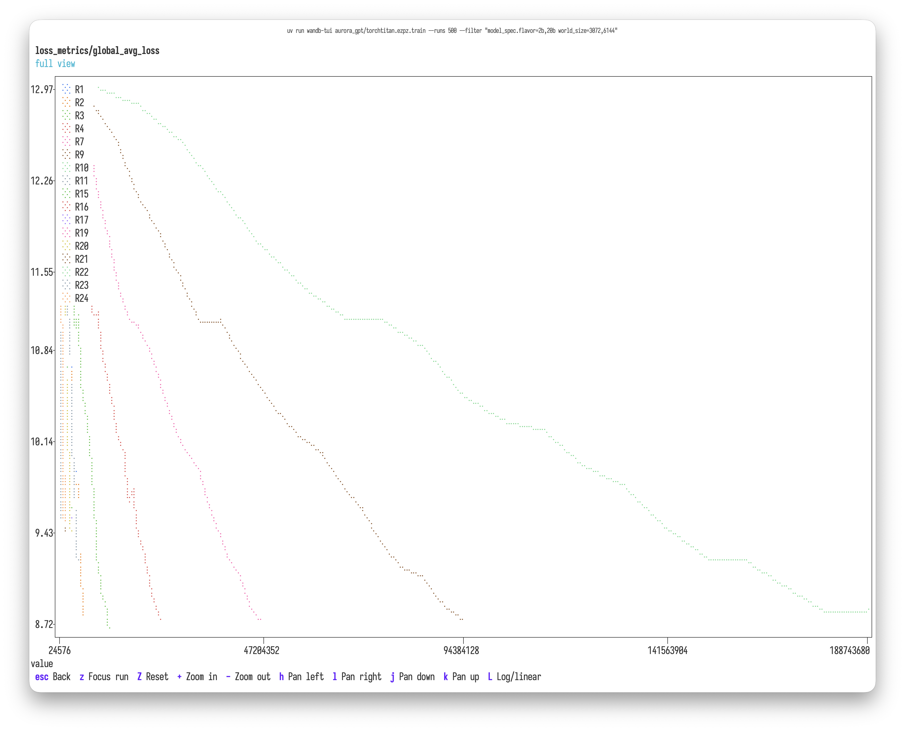
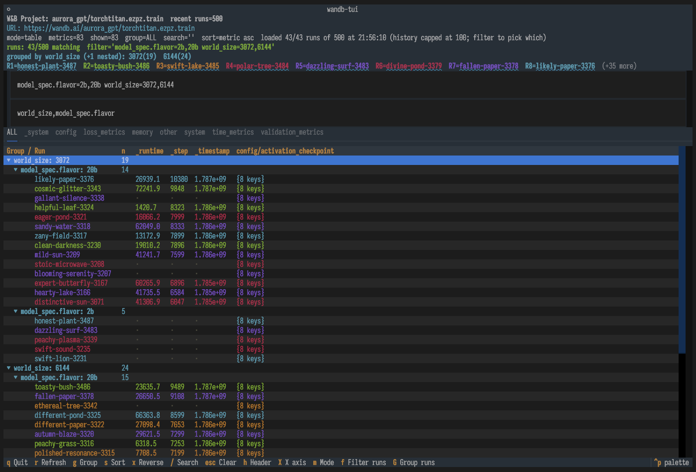
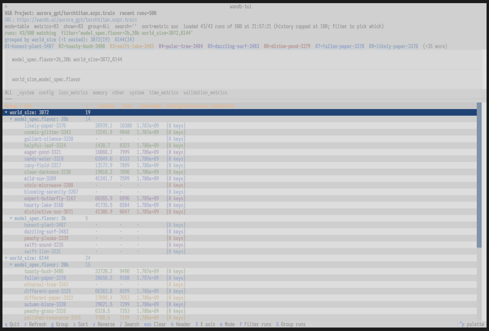

# wandb-tui

A lightweight terminal dashboard for comparing Weights & Biases runs directly from W&B project or run URLs.

It was built for remote/cloud W&B runs when you want a LEET-like terminal view without needing the original local `wandb/` run directories.



Twenty-four runs out of a 500-run project, filtered by config and plotted
against `n_tokens_seen`.

## Screenshots

The TUI follows your terminal's light/dark theme:

<details>
<summary>Light theme</summary>



</details>

Focus a chart tile and press <kbd>Enter</kbd> to open it full-screen, with
zoom, pan, per-run focus and a log/linear toggle:



<details>
<summary>Light theme</summary>



</details>

## Features

- Single-run metric dashboard
- Multi-run project comparison from a W&B project URL
- W&B-style per-run colored columns
- `plotext` line charts for multi-run metric overlays
- Metric search, group filtering, sorting, and refresh
- JSON export for downstream analysis
- Works against public runs without `wandb` installed; uses `WANDB_API_KEY` automatically for private runs

## Install

No install needed — run it straight from PyPI:

```bash
uvx wandb-tui --help
```

To pin a version, or to run the development version:

```bash
uvx wandb-tui@latest --help
uvx --from git+https://github.com/saforem2/wandb-tui wandb-tui --help
```

<details>
<summary>Working on wandb-tui itself</summary>

```bash
uv sync
uv run wandb-tui --help
uv run python -m wandb_tui --help   # or as a module
uv run pytest                       # tests
```

</details>

## Usage

### Interactive startup picker

If you launch without a W&B URL or `ENTITY/PROJECT`, `wandb-tui` opens a startup picker:

```bash
uvx wandb-tui
```

The picker lets you choose a W&B owner/entity, then a project, then opens the multi-run project dashboard. For private entities, set `WANDB_API_KEY` first.

### Compare recent runs in a project

```bash
uvx wandb-tui \
  'https://wandb.ai/aurora_gpt/ezpz.examples.fsdp_tp?nw=nwuserforemans' \
  --runs 8
```

Press `m` to toggle from table mode to plot mode.

### View a single run

```bash
uvx wandb-tui \
  https://wandb.ai/aurora_gpt/ezpz.examples.fsdp_tp/runs/vrxuo55p
```

### Non-interactive table snapshot

```bash
uvx wandb-tui \
  'https://wandb.ai/aurora_gpt/ezpz.examples.fsdp_tp?nw=nwuserforemans' \
  --runs 8 \
  --once \
  --search train/loss \
  --metric-group train
```

### Export JSON

```bash
uvx wandb-tui \
  'https://wandb.ai/aurora_gpt/ezpz.examples.fsdp_tp?nw=nwuserforemans' \
  --runs 8 \
  --json /tmp/wandb_project_metrics.json
```

## Controls

| Key | Action |
| --- | --- |
| `q` | Quit |
| `↑` / `↓` | Move row cursor |
| `PgUp` / `PgDn` | Page scroll |
| `Home` / `End` | Jump to first/last row |
| `Tab` | Move focus between search box and results |
| `/` | Open the search box (filters metric names) |
| `f` | Open the run filter box (project view) |
| `Esc` | Clear and close the focused box, or both when the results have focus |
| `g` | Cycle metric group filter (or click a group tab) |
| `m` | Toggle table/chart mode in project view |
| `enter` | Open the focused chart full-screen |
| `s` | Cycle sort column |
| `x` | Reverse sort direction (group order, when grouped) |
| `h` | Hide/show the header (title, URL, filters, legend) |
| `G` | Group runs into a tree by config keys (project view) |
| `Enter` | Collapse/expand the selected group row |
| `Space` | Show/hide the selected run (or group) in charts |
| `X` | Cycle the chart x-axis |
| `M` | Cycle the chart marker (hd / braille / fhd / dot / sd) |
| `r` | Refresh from W&B |

Single-letter keys act on the results pane. While a text box has focus they
are typed as text instead — press `Tab` or `Esc` to return focus to the results.

The search and filter boxes stay hidden until you summon them, so the results
get the full height. They close again when they lose focus — unless they still
hold a query, since a filter you can't see is worse than a spent row. Run names
in the legend are clickable links to the run on wandb.ai in terminals that
support hyperlinks (kitty, iTerm2, WezTerm, modern VTE).

The startup entity/project picker supports the same `/` search and `Esc` clear,
matching across every visible column.

## Charts

`m` switches the project view to charts: one tile per metric, sized to the
terminal and re-fit on resize. When metrics fall into more than one top-level
group (`train`, `eval`, `_system`, …) each group gets its own tab.

Focus a tile (`tab`, or click) and press `enter` to open it full-screen:

| Key | Action |
| --- | --- |
| `z` | Cycle focus through runs — fit the view to one run, dim the others |
| `Z` / `0` | Reset the view |
| `+` / `-` | Zoom x in / out |
| `h` / `l` | Pan left / right |
| `j` / `k` | Pan up / down |
| `L` | Toggle y-axis log / linear |
| `esc` | Back to the chart grid |

## Run loading and caching

Project view loads metadata for the 100 most recent runs in a single query,
then fetches full history only for the runs that survive your filter — in
parallel, cached on disk under `~/.cache/wandb-tui` and keyed on each run's
W&B `updatedAt`, so finished runs are read from disk on every later launch.
Use `--runs` to change how many runs' metadata is loaded.

Measured on a 100-run project: a cold history pull is ~1.1s for 24 runs, 3.6s
for 50 and 10.1s for 100, but every warm load is 0.01–0.08s regardless of size.

## Chart x-axis

Charts default to **Step**. Press `X` to cycle the x-axis:

| Axis | Source |
|------|--------|
| Step | `_step` |
| Relative Time (Process) | `_runtime` |
| Relative Time (Wall) | `_timestamp`, zeroed at the run's first point |
| Wall Time | `_timestamp` |
| n_tokens_seen | `train/tokens_seen` (and common aliases) |

The screenshots above use `n_tokens_seen`.

This matters for runs that log at uneven intervals: on the sample-index axis a
47-second stall looks identical to a 1-second one. If a run does not log the
selected axis, that run falls back to its sample index rather than dropping
out of the comparison, and the status line says so.

## Grouping runs

Press `G` and type one or more config keys, comma-separated, to nest runs into
a collapsible tree — the same idea as the W&B workspace's "Group runs by..."
panel. Order is nesting order, and <kbd>Tab</kbd> completes key names.



<details>
<summary>Light theme</summary>



</details>

```
G> world_size,model_spec.flavor

Group / Run                    n   _runtime  _step
▼ world_size: 3072            19
  ▼ model_spec.flavor: 20b    14
        likely-paper-3376         26939.1   10380
        cosmic-glitter-3343       72241.9   9848
  ▼ model_spec.flavor: 2b      5
        honest-plant-3487         ·         ·
▼ world_size: 6144            24
  ▼ model_spec.flavor: 20b    15
        toasty-bush-3486          23635.7   9489
```

<kbd>Space</kbd> toggles a run's visibility in the charts, via the marker in
the left gutter (`◉` shown, `○` hidden, `◐` partly hidden). On a group row it
toggles everything beneath — collapse to a group and hide 95 runs with one
keypress. Hidden runs leave the plots but stay in the table, so their numbers
are still readable.

Each group row shows how many runs sit beneath it. <kbd>Enter</kbd> on a group
row collapses or expands it; <kbd>Esc</kbd> puts the input away but keeps the
grouping, so you can drive the tree straight after typing. Clearing the box
returns to the flat metric table.

Grouping transposes the grid: rows become the run tree, so the columns become
the first few metrics matching your current search. Narrow them with `/`.
Runs missing a key group under `(unset)`. Any config key is accepted — the
completion hint just lists the ones that actually split your runs first.

Grouping is independent of `g`, which filters which *metrics* are shown.

The same keys work from the command line, where `--group-by` presets the tree,
prints it in `--once`, and nests a `groups` array in `--json`:

```bash
uvx wandb-tui ENTITY/PROJECT --group-by 'world_size,model_spec.flavor'
uvx wandb-tui ENTITY/PROJECT --once --group-by world_size
uvx wandb-tui ENTITY/PROJECT --json out.json --group-by world_size
```

> **Note**
> `--group` filters *metric* groups, not runs, and is deprecated in favour of
> the clearer `--metric-group`. It still works and warns on stderr.

## Filtering runs by config

In project view, press `f` and type an expression to keep only the runs whose
config matches — the same idea as filtering a W&B workspace in the browser.
Space-separated terms are AND-ed:

```
lr>=0.001 model~llama state=finished
```

| Operator | Meaning |
| --- | --- |
| `=` / `!=` | Equal / not equal (numeric when both sides are numbers, else case-insensitive string) |
| `>` `<` `>=` `<=` | Numeric comparison |
| `~` / `!~` | Contains / does not contain (case-insensitive substring) |

A comma-separated value means "any of" — set membership rather than a range:

```
world_size=3072,6144        # exactly these two, not 4096 in between
model=llama-3,mistral       # either model
world_size!=3072,6144       # everything except those two
```

Bare keys read the run's config. Use `config.<key>` to be explicit, and
`run.<attr>` for run attributes (`run.state`, `run.name`) when a config key
would otherwise shadow them. Quote values containing spaces: `name~"my run"`.

**Completion.** The filter box suggests as you type and `tab` accepts. Typing a
prefix lists the config keys under it (`precision/` → every `precision/*` key);
once you type an operator it lists the values that key actually takes
(`dim=` → `128  256  2048`). Earlier terms of a compound filter are preserved,
so `tp=4 dim=` completes only the last term. With several matches `tab` extends
to the longest common prefix, like shell completion.

The same expression works non-interactively:

```bash
uvx wandb-tui ENTITY/PROJECT --runs 20 --filter 'lr>=0.001 model~llama' --once
```

## W&B LEET comparison

W&B's official LEET TUI is excellent for local `wandb/` directories and `.wandb` files, and newer versions support remote single-run URLs. This tool focuses on remote multi-run project comparisons over W&B's GraphQL API.

## Notes

- Public W&B projects/runs can be queried without authentication.
- For private projects, set `WANDB_API_KEY` in your environment.
- `plotext` is included as a dependency for chart mode.
